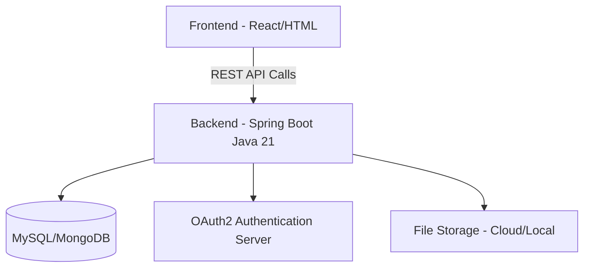

---

# 🌍 **Open Learning Platform for Communities**

> **Empowering underserved communities with free, accessible, and quality learning resources.**


---


## 📖 **Overview**

The **Open Learning Platform for Communities** is a **free and open-source educational platform** designed to provide learning opportunities for people in rural areas, low-income neighborhoods, and underserved regions worldwide.

This platform connects **students**, **teachers**, and **volunteers** in a digital ecosystem where **knowledge is free, accessible, and inclusive**.

### ✨ **Key Features**

* 🎓 **Free Courses & Tutorials** — Access lessons in multiple subjects and skill levels.
* 🧠 **Interactive Quizzes & Assignments** — Reinforce learning with engaging assessments.
* 👩‍🏫 **Role-Based Access Control (RBAC)** — Secure and personalized experience for:

  * **ROLE\_STUDENT** — Learn and track progress.
  * **ROLE\_TEACHER** — Create and manage courses.
  * **ROLE\_VOLUNTEER** — Assist and moderate discussions.
* 🌐 **Multi-Language Support** — Break the language barrier with translations.
* 🔒 **OAuth2 Authentication** — Secure login using Google, Facebook, or Email.
* 📱 **Mobile-Friendly UI** — Learn from any device.

---

## 🏗 **Architecture**



**Tech Stack**:

* **Frontend**: React.js / HTML5 / CSS3 / TailwindCSS
* **Backend**: Java 21 + Spring Boot 3.5
* **Database**: MySQL / MongoDB
* **Authentication**: OAuth2 (Google / Facebook / Email)
* **Hosting**: Docker + Kubernetes (Optional for scaling)

---

## 🚀 **Getting Started**

### **1️⃣ Prerequisites**

Make sure you have installed:

* [Java 21](https://adoptopenjdk.net/)
* [Node.js](https://nodejs.org/) (for frontend)
* [MySQL](https://dev.mysql.com/downloads/) or [MongoDB](https://www.mongodb.com/)
* [Maven](https://maven.apache.org/)

---

### **2️⃣ Installation**

```bash
# Clone the repository
git clone https://github.com/yourusername/open-learning-platform.git
cd open-learning-platform

# Backend Setup
cd backend
mvn clean install
mvn spring-boot:run

# Frontend Setup
cd ../frontend
npm install
npm start
```

---

### **3️⃣ Configuration**

Edit `application.yaml` in the backend to set your **database credentials** and **OAuth2 provider keys**.

```yaml
spring:
  datasource:
    url: jdbc:mysql://localhost:3306/open_learning
    username: root
    password: yourpassword

  security:
    oauth2:
      client:
        registration:
          google:
            client-id: "YOUR_CLIENT_ID"
            client-secret: "YOUR_CLIENT_SECRET"

```

---

## 🎯 **Usage**

1. **Sign Up / Log In** — Use email or social login.
2. **Select Your Role** — Student, Teacher, or Volunteer.
3. **Start Learning or Teaching** — Access free resources or create your own courses.
4. **Engage & Collaborate** — Join discussions, quizzes, and community events.

---

## 🖼 **Screenshots**

| **Login Page**                                               | **Course Dashboard**                                                 | **Mobile View**                                                |
| ------------------------------------------------------------ | -------------------------------------------------------------------- | -------------------------------------------------------------- |
|  |  |  |

---

## 🤝 **Contributing**

We ❤️ contributions from the community!

**Steps to Contribute:**

1. Fork the repository.
2. Create a new branch (`feature/awesome-feature`).
3. Commit your changes.
4. Push to your fork and submit a pull request.

Please follow our [Contribution Guidelines](CONTRIBUTING.md) before submitting.

---

## 🛡 **Security**

We take security seriously.

* OAuth2 for authentication.
* Role-Based Access Control for permissions.
* Encrypted communication with HTTPS.

If you find any vulnerabilities, please report them via **[SECURITY.md](SECURITY.md)**.

---

## 📜 **License**

This project is licensed under the **MIT License** — see the [LICENSE](LICENSE) file for details.

---

## 🌟 **Acknowledgments**

* 🏫 Teachers & Volunteers who contribute knowledge.
* 🌐 Open-source community for tools and inspiration.
* 📚 Everyone passionate about **making education accessible for all**.

---

💡 *"Education is the most powerful weapon which you can use to change the world."* — Nelson Mandela

---

If you want, I can also make you a **visually enhanced README version** with **GitHub Shields badges, gradient headers, and a call-to-action section** so it looks **more attractive like a startup project page**. That would make your repo pop.
